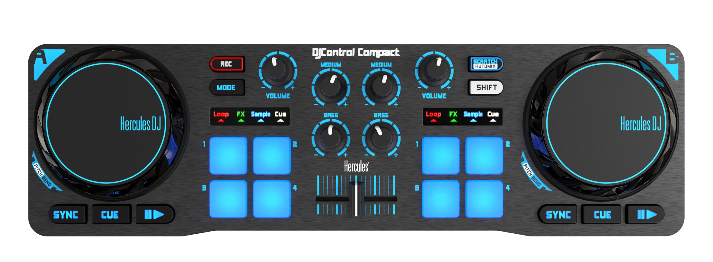

## Custom mappings for [Hercules DJControl Compact for MIXXX DJ Software](https://github.com/mixxxdj/mixxx)


## Manual

- **[Rec]:** Enter Search Track Mode. Use Jog Wheels to scroll and [CUE] to load track to deck.
- **Med Knob:** Mapped to High EQ filter.
- **[CUE] Buttons:** Mapped to on/off the headphone listen of its channels.
- **[Scratch/Automix]:** Toggle between scratch and pitch bend mode, Controller Starts in Scratch Mode.
- **[Shift]+[CUE]:** Trigger CUE funtion (set when stoped / go to when playing).
- **[Shift]+[Play]:** Go to start of the track.


To install, copy files to:
```
/Users/{user}/Library/Containers/org.mixxx.mixxx/Data/Library/Application Support/Mixxx/controllers/
```

To run MIXXX from terminal with controller log verbosity:

```
/Applications/Mixxx.app/Contents/MacOS/mixxx --controller-debug
```
